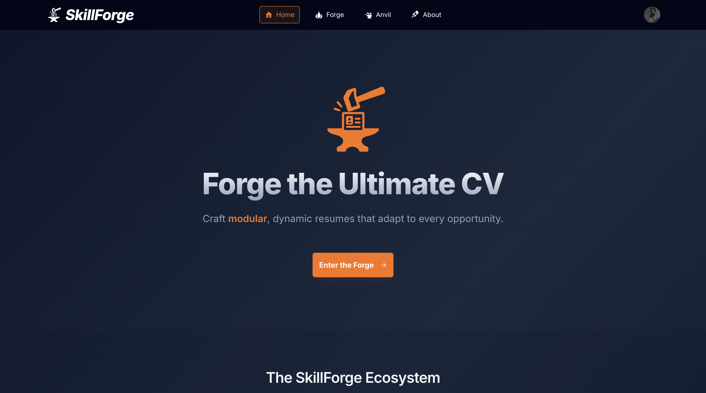
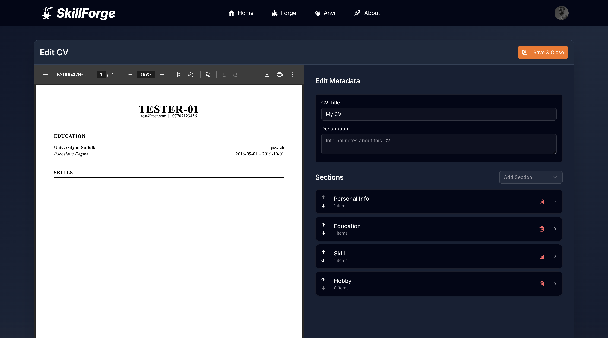
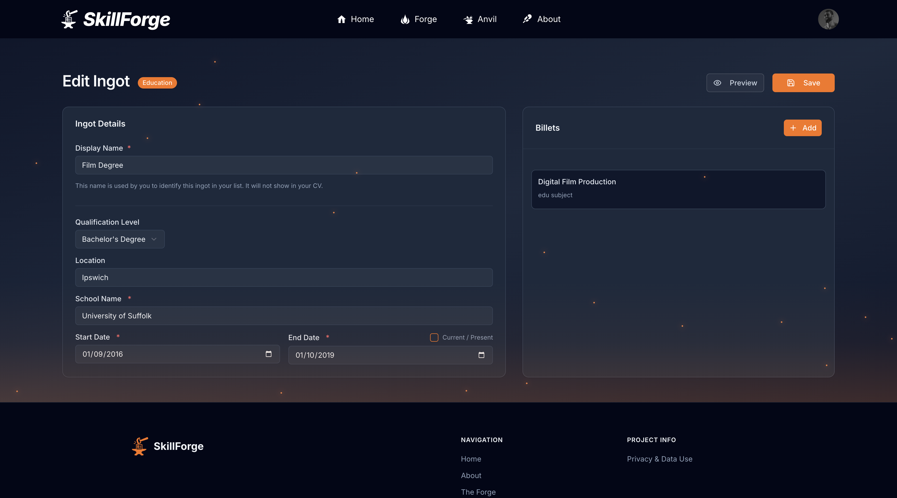

# SkillForge

A modular CV/Resume builder that lets users create, manage, and customise professional CVs using a blacksmithing-themed "ingot" system.

## Screenshots

### Home Page


### Forge Builder


### Anvil Interface


## Architecture

Monorepo with two workspaces:

| Layer | Technology | Location |
|-------|-----------|----------|
| Frontend | Next.js 16, React 19, TypeScript, Tailwind CSS, shadcn/ui | `frontend/` |
| Backend | CDK, API Gateway, Go Lambda, DynamoDB, Cognito, S3 | `infra/` |

The frontend is a **static export** hosted on Amplify Hosting. The backend is a custom CDK stack deployed via a self-mutating CodePipeline.

## Quick Start

### Prerequisites

- Node.js 20.9+
- Bun (package manager)
- Go 1.21+ (for Lambda handlers)
- AWS CLI configured with credentials

### Local Development

```bash
# Install dependencies
bun install

# Deploy the dev backend (first time only, or after infra changes)
bun run infra:dev

# Generate frontend env vars from deployed stack
bun run infra:config:dev

# Start the frontend dev server
bun run dev
```

Open [http://localhost:3000](http://localhost:3000) to view the application.

### Available Scripts

| Command | Action |
|---------|--------|
| `bun run dev` | Start frontend dev server (Turbopack) |
| `bun run build` | Build frontend for production (static export) |
| `bun run test` | Run all tests (frontend + infra + Go) |
| `bun run test:frontend` | Run frontend tests only |
| `bun run test:infra` | Run infra tests (Jest + Go) |
| `bun run lint` | Lint frontend |
| `bun run format` | Format all files with Prettier |
| `bun run type-check` | TypeScript type checking |
| `bun run infra:dev` | Deploy dev backend stack |
| `bun run infra:config:dev` | Generate `frontend/.env.local` from dev stack outputs |
| `bun run infra:synth` | Synthesise CloudFormation (no deploy) |
| `bun run infra:diff` | Show pending infra changes |
| `bun run infra:pipeline` | Deploy/update the CI/CD pipeline |

## Project Structure

```
skillforge/
├── frontend/               # Next.js static export
│   ├── src/
│   │   ├── app/            # App Router pages
│   │   ├── components/     # React components
│   │   ├── hooks/          # Custom hooks
│   │   └── lib/            # Services, stores, types, utilities
│   └── public/             # Static assets
├── infra/                  # CDK backend
│   ├── bin/                # CDK app entry points
│   ├── lib/                # Constructs, config, utils, tests
│   ├── lambda/             # Go Lambda handlers
│   │   ├── shared/         # Shared Go module (models, auth, response)
│   │   ├── cv-handler/     # CV CRUD handler
│   │   └── ingot-handler/  # Ingot CRUD handler
│   └── scripts/            # Deployment helpers
└── docs/                   # Documentation
```

## Tech Stack

- **Frontend**: Next.js 16, React 19, TypeScript, Tailwind CSS v4, shadcn/ui, Zustand, React Hook Form + Zod
- **Backend**: AWS CDK, API Gateway (REST), Go Lambda (ARM64), DynamoDB, Cognito, S3
- **CI/CD**: CDK Pipelines (CodePipeline + CodeBuild), Amplify Hosting
- **Testing**: Jest (frontend + CDK), Go test (Lambda handlers)

## Documentation

- **[API Schema](docs/API_SCHEMA.md)** — REST API reference (endpoints, models, auth)
- **[Auth Reference](docs/AUTH_REFERENCE.md)** — Authentication patterns
- **[Deployment](docs/DEPLOYMENT.md)** — Pipeline, stages, first-time setup
- **[Components](docs/COMPONENTS_FOLDER.md)** — Frontend component structure
- **[Color Scheme](docs/COLOR_SCHEME.md)** — Design system palette
